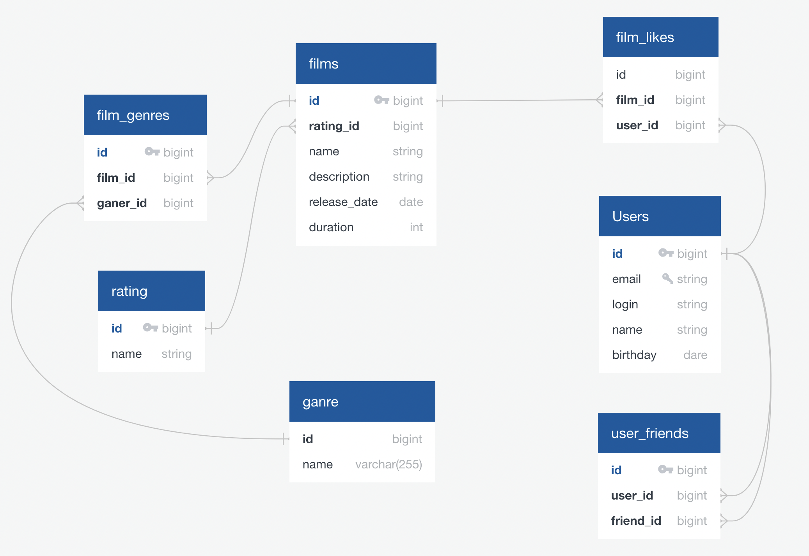

# java-filmorate
Template repository for Filmorate project.

### Create by https://app.quickdatabasediagrams.com/#/



```
films
-
id PK bigint
rating_id bigint FK >- rating.rating_id
name string
description string
release_date date
duration int

film_genres
-
id PK bigint
film_id bigint FK >- films.id
ganer_id bigint FK >- ganer.ganer_id

ganer
-
ganer_id bigint
name varchar(255)

rating
-
rating_id PK bigint
name string

film_likes
-
id bigint
film_id bigint FK >- films.id
user_id bigint FK >- users.id

Users
-
id PK bigint
email UNIQUE string
login string
name string
birthday dare

user_friends
-
id PK bigint
user_id bigint FK >- users.id
friend_id bigint FK >- users.id
```